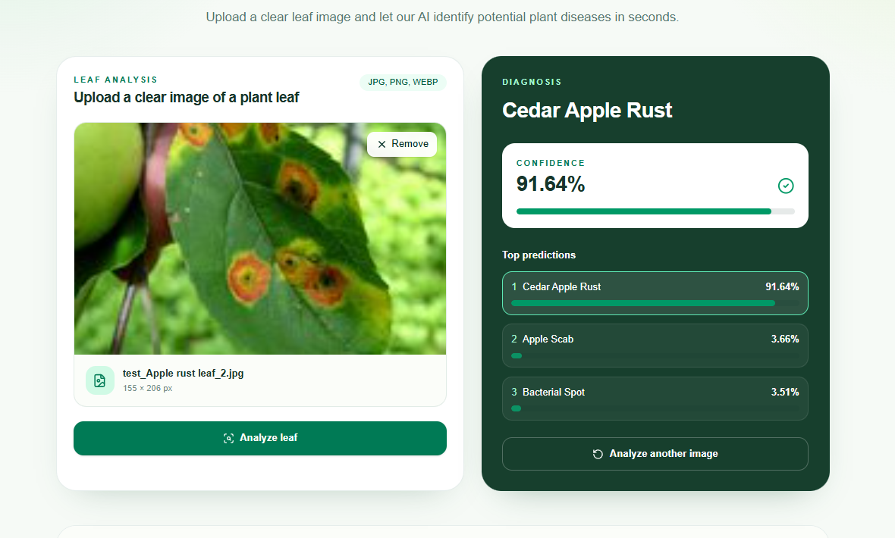
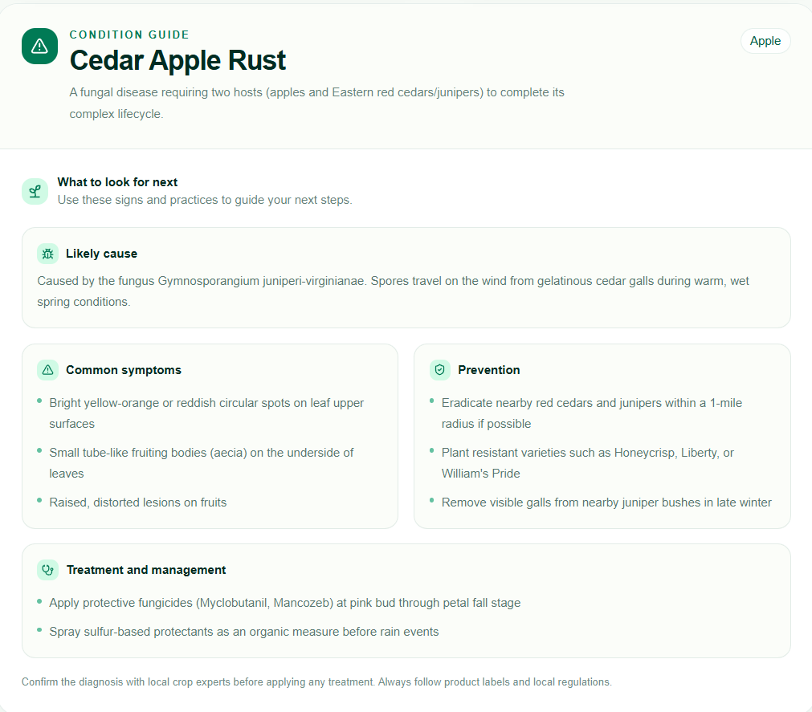

# 🌿 LeafLens AI


---

## 📌 Overview

**LeafLens AI** is an AI-powered plant disease detection system that identifies plant diseases from leaf images using **deep learning and computer vision**.

The project combines a modern **Next.js frontend** with a **FastAPI machine learning backend**. Users can upload a leaf image, which is processed by a trained **EfficientNetB0** model and classified into one of **38 plant disease or healthy classes**.

The current prototype focuses on building a reliable end-to-end pipeline from image upload to AI-powered prediction while keeping the architecture modular enough for future scaling.

---

## ✨ Features

### 🌿 AI Plant Disease Detection

- **Image-based disease detection:** Upload plant leaf images for disease analysis.
- **EfficientNetB0 classification:** Uses an ImageNet-pretrained EfficientNetB0 model.
- **38-class classification:** Supports 38 plant disease and healthy classes.
- **Confidence score:** Displays the confidence of the predicted class.
- **Top-3 predictions:** Shows the three most likely predictions with confidence values.

### 🖼️ Image Upload & Processing

- Drag-and-drop image upload.
- Image preview before prediction.
- Image metadata display.
- Automatic image conversion to RGB.
- Image resizing to `224 × 224`.
- Loading and prediction states.
- Error handling.
- Reset and re-upload functionality.

### 🧠 Machine Learning Pipeline

- Transfer learning using **ImageNet-pretrained EfficientNetB0**.
- Two-phase training:
  - Feature extraction
  - Fine-tuning
- Data augmentation for better generalization.
- Class weighting for handling class imbalance.
- Mixed-precision training for improved GPU efficiency.
- Early stopping to reduce overfitting.
- Learning-rate reduction when validation performance plateaus.
- Automatic checkpointing of the best model.

### 🔌 FastAPI Inference Backend

- Dedicated `/predict` API endpoint.
- Accepts images using `multipart/form-data`.
- Loads the trained Keras model during server startup.
- Performs image preprocessing and inference.
- Returns structured JSON predictions.

### 🎨 Modern Frontend

- Built using **Next.js App Router**.
- Responsive design for desktop and mobile.
- Clean upload and prediction workflow.
- Confidence bars for predictions.
- User-friendly error handling.
- Centralized API integration.

---

## 📸 Screenshots

### 🏠 Home Page (EN)


### 🏠 Home Page (HN)


### 📤 Image Upload 



### 📤 Description




## 🧠 Machine Learning Architecture

The current model follows this pipeline:

```text
Input Image
224 × 224 × 3
       ↓
Data Augmentation
       ↓
EfficientNetB0
ImageNet Pretrained
       ↓
Global Average Pooling
       ↓
Dropout (30%)
       ↓
Dense Layer
38 Classes
       ↓
Softmax
       ↓
Disease Probabilities
```

### 🔬 Training Strategy

The model is trained in two stages.

### Phase 1 — Feature Extraction

The pretrained EfficientNetB0 backbone is frozen while the newly added classification layer learns to classify plant diseases.

### Phase 2 — Fine-Tuning

The later layers of EfficientNetB0 are unfrozen and trained using a smaller learning rate so that the pretrained features can adapt to plant disease patterns.

---

## 🖼️ Data Augmentation

The training pipeline applies:

- Random horizontal and vertical flipping
- Random rotation
- Random zoom
- Random translation
- Random contrast
- Random brightness

These augmentations help the model handle variations in:

- Leaf orientation
- Position
- Scale
- Lighting
- Contrast

This is especially important for improving performance on real-world images.

---

## ⚖️ Class Weighting

The training pipeline uses Scikit-learn's:

```python
compute_class_weight()
```

to calculate balanced class weights.

This helps prevent the model from becoming biased toward classes that contain more training examples.

---

## ⚡ Training Optimizations

### Mixed Precision

```python
mixed_precision.set_global_policy("mixed_float16")
```

Mixed precision reduces GPU memory usage and can improve training speed on compatible GPUs.

### GPU Memory Growth

TensorFlow dynamically allocates GPU memory instead of reserving all available memory at startup.

### Dataset Prefetching

```python
tf.data.AUTOTUNE
```

is used to prepare batches efficiently while the model is training.

---

## 🛡️ Overfitting Prevention

The training pipeline uses several techniques:

- **Dropout — 30%**
- **EarlyStopping**
- **ReduceLROnPlateau**
- **ModelCheckpoint**
- Data augmentation
- Transfer learning

The best-performing model based on validation accuracy is saved as:

```text
best_plant_disease_model.keras
```

---

## 📊 Model Output

The model produces probabilities for all 38 classes.

Example:

```json
{
  "disease": "Tomato___Early_blight",
  "confidence": 98.42,
  "top_predictions": [
    {
      "disease": "Tomato___Early_blight",
      "confidence": 98.42
    },
    {
      "disease": "Tomato___Late_blight",
      "confidence": 0.91
    },
    {
      "disease": "Tomato___Leaf_Mold",
      "confidence": 0.31
    }
  ]
}
```

---

## 🔌 API

### `POST /predict`

Accepts a plant leaf image and returns the model prediction.

### Request

```text
Content-Type: multipart/form-data

file = <leaf image>
```

### Response

```json
{
  "success": true,
  "filename": "leaf.jpg",
  "disease": "Tomato___Early_blight",
  "confidence": 98.42,
  "top_predictions": [
    {
      "disease": "Tomato___Early_blight",
      "confidence": 98.42
    }
  ]
}
```

---

## 🛠️ Tech Stack

### Frontend

- Next.js — App Router
- React 19
- TypeScript
- Tailwind CSS

### Backend

- Python
- FastAPI
- Uvicorn
- Pillow

### Machine Learning

- TensorFlow
- Keras
- EfficientNetB0
- NumPy
- Scikit-learn

### Model Training

- Transfer Learning
- Fine-Tuning
- Data Augmentation
- Mixed Precision
- Class Weighting

---

## 📂 Project Structure

```text
SIH/
│
├── backend/
│   │
│   ├── main.py
│   ├── predict.py
│   ├── train.py
│   ├── evaluate.py
│   ├── evaluate_vald.py
│   │
│   ├── models/
│   │   ├── best_plant_disease_model.keras
│   │   ├── plant_disease_model.keras
│   │   └── class_names.json
│   │
│   └── test/
│
├── frontend/
│   │
│   ├── app/
│   │
│   ├── components/
│   │   └── leaf-diagnosis.tsx
│   │
│   ├── lib/
│   │   └── prediction-api.ts
│   │
│   ├── .env.example
│   └── package.json
│
└── README.md
```

---

## 🚀 Getting Started

### 1. Clone the Repository

```bash
git clone <your-repository-url>

cd SIH
```

---

### 2. Backend Setup

Navigate to the backend:

```bash
cd backend
```

Create a Python virtual environment:

```bash
python -m venv venv
```

### Windows

```bash
venv\Scripts\activate
```

### Linux / Ubuntu

```bash
source venv/bin/activate
```

Install dependencies:

```bash
pip install -r requirements.txt
```

Start the FastAPI server:

```bash
uvicorn main:app --reload --host 0.0.0.0 --port 8000
```

Backend:

```text
http://127.0.0.1:8000/
```

---

### 3. Frontend Setup

Open another terminal:

```bash
cd frontend
```

Install dependencies:

```bash
bun install
```

Start the development server:

```bash
bun run dev
```

Frontend:

```text
http://localhost:3000
```

---

## 🧪 Testing the Model

The project contains evaluation scripts for checking model performance.

### Validation Dataset Evaluation

```bash
python evaluate_vald.py
```

This evaluates the model against the validation dataset and generates:

- Accuracy
- Classification report
- Confusion matrix

### Test Image Evaluation

```bash
python evaluate.py
```

This evaluates individual images stored inside the `test` directory and reports:

- Actual class
- Predicted class
- Confidence
- Overall test accuracy
- Classification report
- Confusion matrix

---

## 📈 Current Prototype

The current prototype provides:

- ✅ End-to-end image upload
- ✅ Next.js frontend
- ✅ FastAPI backend
- ✅ EfficientNetB0 classification
- ✅ 38 disease/healthy classes
- ✅ Top-3 predictions
- ✅ Confidence scores
- ✅ Data augmentation
- ✅ Transfer learning
- ✅ Fine-tuning
- ✅ Class weighting
- ✅ Mixed precision
- ✅ Error handling
- ✅ Responsive UI

The current validation accuracy is approximately **98.07%** on the current validation dataset.

> **Note:** Validation accuracy does not guarantee the same performance on real-world images. Images with complex backgrounds, unusual lighting, blur, or multiple leaves can be more challenging.

---

## ⚠️ Current Limitations

The current model can struggle with:

- Complex backgrounds
- Poor lighting
- Unusual lighting conditions
- Multiple leaves in one image
- Very small leaves
- Blurry images
- Image noise
- Objects other than the target leaf

Additionally, a high softmax confidence score does not necessarily guarantee that the prediction is correct.

---

## 🔮 Future Improvements

### 🌱 Improved Real-World Robustness

The next training iterations will include more diverse field images containing:

- Complex backgrounds
- Different lighting conditions
- Different camera qualities
- Different leaf orientations
- Different distances and angles

### ✂️ Leaf Segmentation

A future version can isolate the leaf before classification:

```text
User Image
    ↓
Leaf Detection / Segmentation
    ↓
Background Removal
    ↓
Isolated Leaf
    ↓
Disease Classification
```

This should reduce the effect of irrelevant background information.

### 🧠 Stronger Data Augmentation

Future augmentation can include:

- Random cropping
- Blur
- Image noise
- Stronger brightness variation
- Color perturbation
- Background variation

### 🎯 Confidence-Based Decision System

Instead of always returning a disease prediction:

```text
High Confidence
      ↓
Show Prediction

Low Confidence
      ↓
Request Better Image
```

This can make the system more reliable for real-world use.

### 📈 Scalable Architecture

The system can eventually be deployed as independent services:

```text
Next.js Frontend
       ↓
API Gateway
       ↓
FastAPI Inference Service
       ↓
Model Serving
       ↓
Database / Storage
```

This allows the frontend and ML inference service to scale independently.

---

## 🌍 Future Product Vision

LeafLens AI can eventually evolve from a disease classifier into a complete **AI-powered plant health assistant**.

Potential features include:

- 🌿 Disease detection
- 💊 Treatment recommendations
- 📊 Disease severity estimation
- ✂️ Leaf segmentation
- 🌱 Multiple-leaf analysis
- 📷 Plant health monitoring
- 📚 Disease information
- 🌐 Multilingual support
- 📱 Mobile application
- ⚡ Edge / offline inference

---

## 📚 References

### Datasets

**PlantVillage Dataset**

https://github.com/spMohanty/PlantVillage-Dataset

**PlantDoc Dataset**

https://www.kaggle.com/datasets/abdulhasibuddin/plant-doc-dataset

### Model

**EfficientNet — Tan & Le (2019)**

https://proceedings.mlr.press/v97/tan19a.html

### TensorFlow / Keras

**TensorFlow EfficientNetB0**

https://www.tensorflow.org/api_docs/python/tf/keras/applications/EfficientNetB0

**Keras EfficientNet Fine-Tuning**

https://keras.io/examples/vision/image_classification_efficientnet_fine_tuning/

---

## 📌 Project Status

**Current Stage: Working Prototype 🚀**

The complete pipeline is currently functional locally:

```text
Image Upload
     ↓
Next.js
     ↓
FastAPI
     ↓
Image Preprocessing
     ↓
EfficientNetB0
     ↓
38-Class Prediction
     ↓
Confidence + Top-3
     ↓
Frontend Results
```

The next major focus is **improving real-world robustness, validating the model on more diverse images, and preparing the architecture for scalable deployment**.
